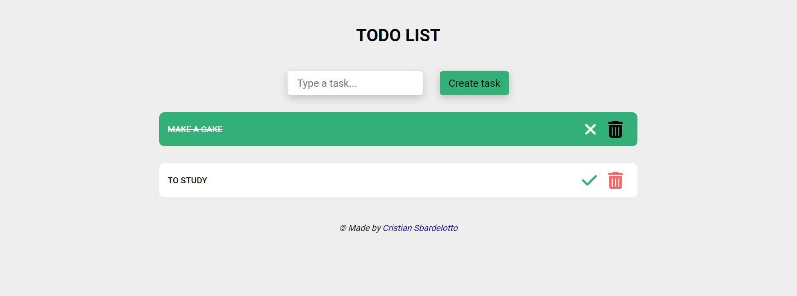

<h1 align="center"> To Do List ✅ </h1>

Simple to-do list that allows user to create, delete and mark tasks.

  <a href="#technologies">Technologies</a>&nbsp;&nbsp;&nbsp;|&nbsp;&nbsp;&nbsp;
  <a href="#installation">Installation</a>&nbsp;&nbsp;&nbsp;|&nbsp;&nbsp;&nbsp;
  <a href="#layout">Layout</a>&nbsp;&nbsp;&nbsp;&nbsp;&nbsp;&nbsp;

 

  

<h2 id='technologies'>🖱️ Technologies</h2>

This project was made with the following technologies/libraries:

- React
- TypeScript
- Styled-Components
- Font-Awesome
- Vite
- ESLint
- Git
- Github

 

<h2 id='layout'>🖥️ Layout</h2>

 

> To see the Deploy, check [THIS LINK](https://to-do-list-henna-three.vercel.app)

 

<h2 id='installation'>📤 Installation</h2>

> <h4>Firstly, you need to <strong>clone the project</strong> on your machine:</h4>
 

<code>git clone https://github.com/cristian-sbardelotto/to-do-list</code>

 

> <h4>After that, open the project folder and <strong>install the dependencies:</strong></h4>

<code>npm i</code>

<code>yarn</code>

> <h4>To <strong>run the project</strong> on your browser, use:</h4>

<code>npm run dev</code>

<code>yarn dev</code>

 

---

<h2 align='center'>Enjoy this project!</h2>

 

Developed with ❤️ by <strong>Cristian Sbardelotto</strong>

 

[Check my portfolio](https://bit.ly/portfolioSbardelotto)

